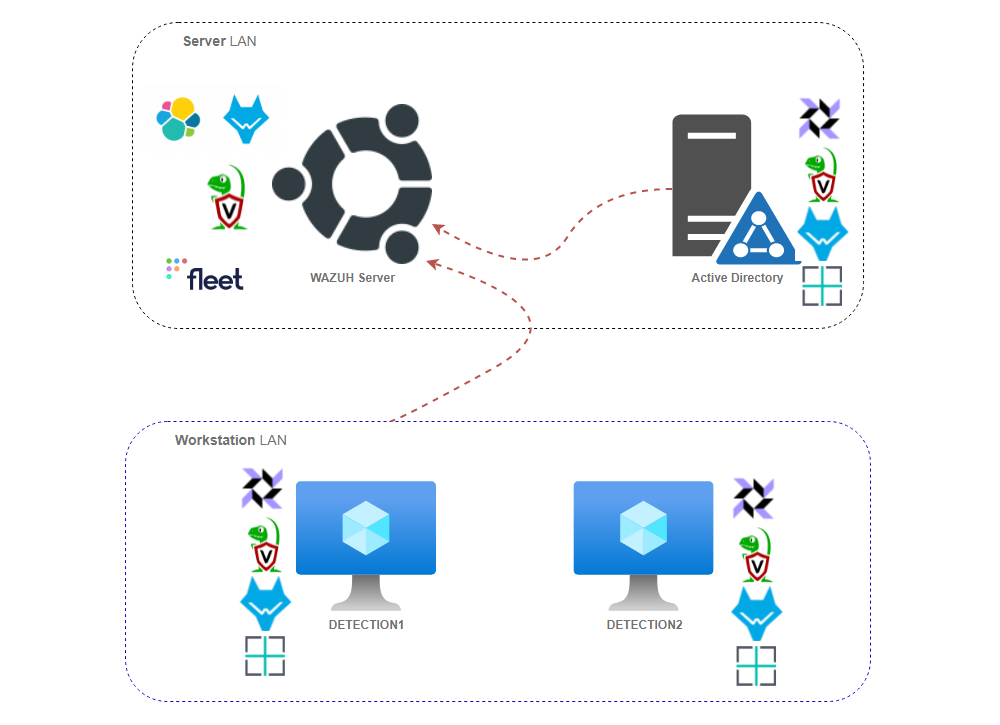
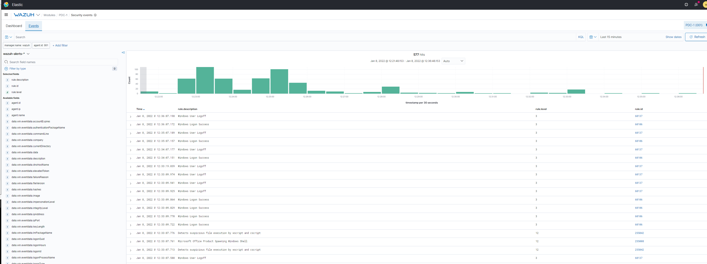
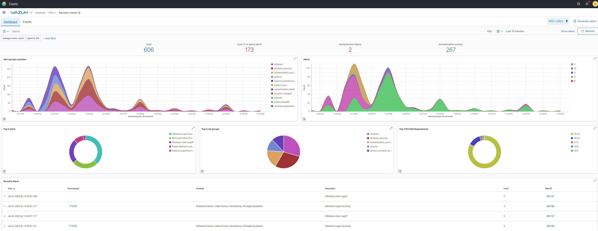
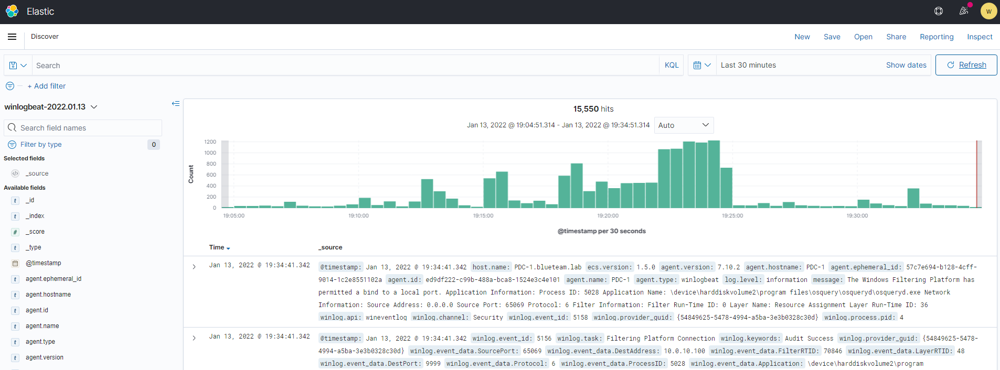
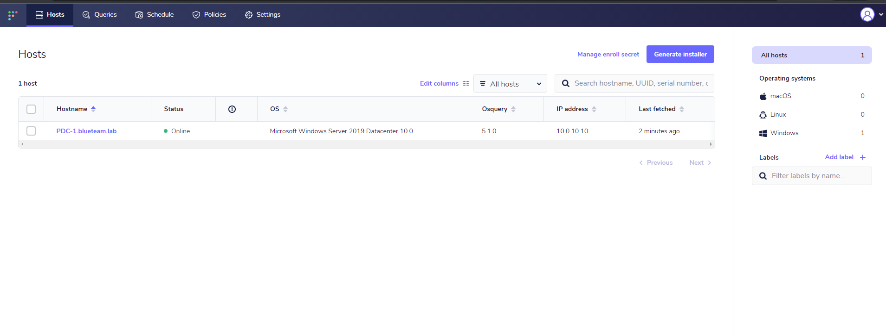
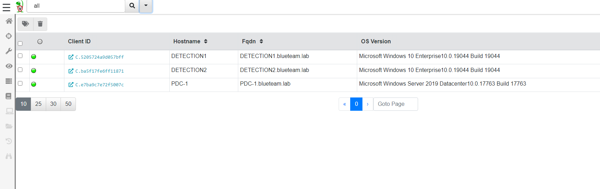
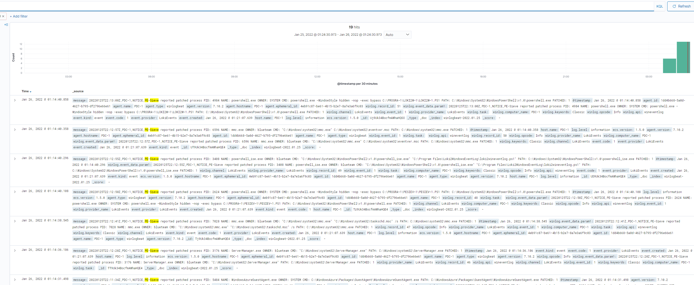
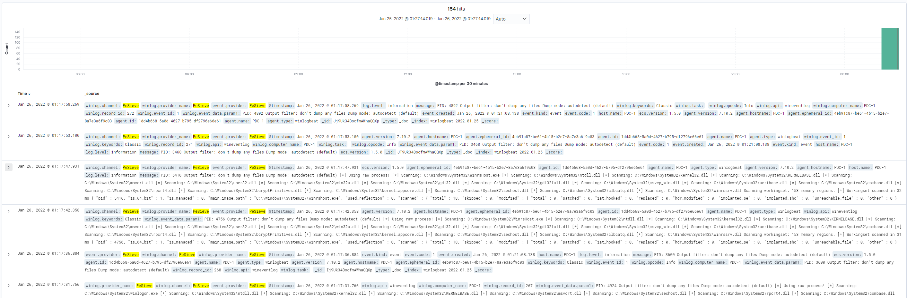

# BlueTeam.Lab

<p align="center">
  
</p>


# Purpose

This project contains a set of **Terraform** and **Ansible** scripts to create an orchestrated BlueTeam Lab. The goal of this project is to provide the red and blue teams with the ability to deploy an ad-hoc detection lab to test various attacks and forensic artifacts on the latest Windows environment and then to get a 'SOC-like' view into generated data. 

NOTE: This lab is deliberately designed to be insecure. Please do not connect this system to any network you care about. 

--- 

# Lab Layout



---

# Prerequisites

A number of features need to be installed on your system in order to use this setup. 
```bash
# Step 1 - Install Azure CLI. More details on https://docs.microsoft.com/en-us/cli/azure/install-azure-cli-linux?pivots=apt
curl -sL https://aka.ms/InstallAzureCLIDeb | sudo bash

# Step 2 - Install Terraform. More details on https://learn.hashicorp.com/tutorials/terraform/install-cli
sudo apt-get update && sudo apt-get install -y gnupg software-properties-common curl
curl -fsSL https://apt.releases.hashicorp.com/gpg | sudo apt-key add -
sudo apt-add-repository "deb [arch=amd64] https://apt.releases.hashicorp.com $(lsb_release -cs) main"
sudo apt-get update && sudo apt-get install terraform

# Step 3 - Install Ansible. More details on https://docs.ansible.com/ansible/latest/installation_guide/intro_installation.html
sudo apt update
sudo apt install software-properties-common
sudo add-apt-repository --yes --update ppa:ansible/ansible
sudo apt update
sudo apt install ansible

# Step 4 - Finally install python and various packages needed for remote connections and other activities
sudo apt install python3 python3-pip
pip3 install pywinrm requests msrest msrestazure azure-cli
pip3 install -r https://raw.githubusercontent.com/ansible-collections/azure/refs/heads/dev/requirements.txt
```

# Building and Deploying BlueTeam.Lab

Once all the [prerequisites](#Prerequisites) are installed, perform the following series of steps:
```bash
# Log in to Azure from command line to ensure that the access token is valid
az login

# Clone Repository and move to BlueTeam.Lab folder
git clone https://github.com/op7ic/BlueTeam.Lab.git && cd BlueTeam.Lab

# Initialize Terraform and begin planning
terraform init && terraform plan

# Create your lab using the following command. 
terraform apply -auto-approve

# Verify the layout of your environment using Ansible
cd ansible && ANSIBLE_CONFIG=./ansible.cfg ansible-inventory --graph -i inventory.azure_rm.yml -vvv && cd ../

# To see IPs of individual hosts and other setup details use the following command: 
cd ansible && ANSIBLE_CONFIG=./ansible.cfg ansible-inventory -i inventory.azure_rm.yml -vvv --list && cd ../

# Once done, destroy your lab using the following command:
terraform destroy -auto-approve

# If you would like to time the execution us following command:
start_time=`date +%s` && terraform apply -auto-approve && end_time=`date +%s` && echo execution time was `expr $end_time - $start_time` s

#NOTE: It will take about two hours to configure it all, depending on your selected hardware.
```

# Deploying Different Windows Versions

Terraform [variables](variables.tf) set the type of operating systems used for this deployment. A simple modification to runtime variables allows to specify different OS to run the entire Active Directory (AD) on. The default option is to use **Windows 10 Enterprise** for **Workstations** and **Windows Server 2019 Datacenter** for **Domain Controller**. Here are examples of a few common configuration options that can be used to modify the entire environment to use different OS versions:

```bash
# Use Windows 10 Enterprise for Workstations and Server 2019 Datacenter for DC (default option)
terraform apply -auto-approve

# Use Windows 11 Enterprise for Workstations and Server 2019 Datacenter for DC
terraform apply -auto-approve  -var="workstation_os=Windows-11" -var="workstation_SKU=win11-21h2-ent" -var="workstations_vm_size=Standard_DC2s_v2" 

# Use Windows 11 Enterprise for Workstations and Server 2012 Datacenter for DC
terraform apply -auto-approve -var="workstation_os=Windows-11" -var="workstation_SKU=win11-21h2-ent" -var="workstations_vm_size=Standard_DC2s_v2" -var="dc_os=WindowsServer" -var="dc_SKU=2012-Datacenter"

# Use Windows 11 Enterprise for Workstations and Server 2016 Datacenter for DC
terraform apply -auto-approve -var="workstation_os=Windows-11" -var="workstation_SKU=win11-21h2-ent" -var="workstations_vm_size=Standard_DC2s_v2" -var="dc_os=WindowsServer" -var="dc_SKU=2016-Datacenter"

# Use Windows 10 Pro N for Workstations and Server 2012 Datacenter for DC
terraform apply -auto-approve -var="workstation_os=Windows-10" -var="workstation_SKU=21h1-pron" -var="dc_os=WindowsServer" -var="dc_SKU=2012-Datacenter"
```

Command ```az vm image list``` can be used to identify various OS versions for the deployment.

---
# Features

- Windows AD with two workstations connected to Windows domain in default setup.
- Flexible [domain configuration file](ansible/domain_setup.yml) allowing for easy changes to the underlying configuration.
- Auditing policies configured based on [CIS Guide](https://www.cisecurity.org/blog/prepare-for-your-next-cybersecurity-compliance-audit-with-cis-resources/) to increase event visibility across Windows infrastructure. [Auditpol](https://www.ultimatewindowssecurity.com/wiki/page.aspx?spid=Auditpol) used to configure additional settings and PowerShell Transcript Logs enabled.
- [Sysmon64](https://docs.microsoft.com/en-us/sysinternals/downloads/sysmon) deployed across infrastructure using the latest [SwiftOnSecurity](https://github.com/SwiftOnSecurity/sysmon-config) configuration for Windows devices.
- [Wazuh Server](https://wazuh.com/) configured and operational to collect logs from devices.
- [Wazuh Agents](https://documentation.wazuh.com/current/installation-guide/wazuh-agent/wazuh-agent-package-windows.html) configured across infrastructure and feeding data into the Wazuh server.
- Firewall configured to only allow your own IP to access the deployed systems. 
- [OSQuery](https://osquery.readthedocs.io/en/stable/installation/install-windows/) and [FleetDM](https://github.com/fleetdm/fleet) installed across the infrastructure, using configuration templates from [Palantir](https://github.com/palantir/osquery-configuration).
- [Velocidex Velociraptor](https://github.com/Velocidex/velociraptor) Server configured and operational.
- [Velocidex Velociraptor](https://github.com/Velocidex/velociraptor) Agents configured across infrastructure and feeding data into the Velociraptor server.
- [WinLogBeat](https://www.elastic.co/guide/en/beats/winlogbeat/current/_winlogbeat_overview.html) configured to log data into Elastic instance.
- [LokiToWinEventLog](https://github.com/op7ic/LokiToWinEventLog) Loki Scanner configured to log data to Windows Event log every 3 hours and ship data to Elastic instance installed with [Wazuh Server](https://wazuh.com/).
- [Pe-SieveToWinEventLog](https://github.com/op7ic/Pe-SieveToWinEventLog) Pe-Sieve Scanner configured to log data to Windows Event log every 3 hours and ship data to Elastic instance installed with [Wazuh Server](https://wazuh.com/).

---
# Documentation

The following section describes various components making up this lab along with details on how to change configuration files to modify the setup:

- [OSQuery and Fleetdm Server](documentation/osquery.md)
- [Wazuh Server and Wazuh Agent](documentation/wazuh.md)
- [Sysmon](documentation/sysmon.md)
- [WinLogBeat](documentation/winlogbeat.md)
- [Velociraptor Server and Velociraptor Agent](documentation/velociraptor.md)
- [Domain Members](documentation/winmember.md)

# Credentials

Once lab is constructed, Terraform will print out actual location of the systems and associated credentials. An example output can be found below.

```bash
Network Setup:

Domain Controller = xx.xx.xx.xx
Workstation DETECTION1: xx.xx.xx.xx
Workstation DETECTION2: xx.xx.xx.xx
Wazuh Server IP = xx.xx.xx.xx
Wazuh Web Interface = https://xx.xx.xx.xx:443/
Velociraptor Web Inteface: = https://xx.xx.xx.xx:10000/
FleetDM Web Interface: = https://xx.xx.xx.xx:9999/

Credentials:

Domain Admin:
    blueteam.lab\blueteam BlueTeamDetection0%%%
Local Admin on Workstations:
    blueteam BlueTeamDetection0%%%
Wazuh Server SSH Login:
    blueteam BlueTeamDetection0%%%
Wazuh Logins:
    wazuh  BlueTeamDetection0%%%
    admin  BlueTeamDetection0%%%
    kibanaserver  BlueTeamDetection0%%%
    kibanaro  BlueTeamDetection0%%%
    logstash  BlueTeamDetection0%%%
    readall  BlueTeamDetection0%%%
    snapshotrestore  BlueTeamDetection0%%%
    wazuh_admin  BlueTeamDetection0%%%
    wazuh_user  BlueTeamDetection0%%%
Velociraptor Web Inteface Login:
    blueteam BlueTeamDetection0%%%
FleetDM Web Inteface Login:
    blueteam@blueteam.lab BlueTeamDetection0%%%

RDP to Domain Controller:
xfreerdp /v:xx.xx.xx.xx /u:blueteam.lab\\blueteam '/p:BlueTeamDetection0%%%' +clipboard /cert-ignore

RDP to Workstation DETECTION1: xx.xx.xx.xx
xfreerdp /v:xx.xx.xx.xx /u:blueteam '/p:BlueTeamDetection0%%%' +clipboard /cert-ignore

RDP to Workstation DETECTION2: xx.xx.xx.xx
xfreerdp /v:xx.xx.xx.xx /u:blueteam '/p:BlueTeamDetection0%%%' +clipboard /cert-ignore
```

---
# Firewall Configuration

The following table summarises a set of firewall rules applied across the BlueTeamLab enviroment in default configuration. Please modify the [main.tf](main.tf) file to add new firewall rules as needed in  the **Firewall Rule Setup** section.

| Rule Name | Network Security Group | Source Host | Source Port  | Destination Host | Destination Port |
| ------------- | ------------- |  ------------- |  ------------- |  ------------- |  ------------- |
| Allow-RDP  | windows-nsg  | [Your Public IP](https://ipinfo.io/json) | * | PDC-1, DETECTION1, DETECTION2  | 3389 |  
| Allow-WinRM  | windows-nsg  | [Your Public IP](https://ipinfo.io/json) | * | PDC-1, DETECTION1, DETECTION2 | 5985 |  
| Allow-WinRM-secure | windows-nsg  | [Your Public IP](https://ipinfo.io/json) | * | PDC-1, DETECTION1, DETECTION2 | 5986 |  
| Allow-SMB  | windows-nsg  | [Your Public IP](https://ipinfo.io/json) | * | PDC-1, DETECTION1, DETECTION2 | 445 |
| Allow-SSH  | wazuh-nsg  | [Your Public IP](https://ipinfo.io/json) | * | Wazuh | 22 |  
| Allow-Wazuh-Manager  | wazuh-nsg  | [Your Public IP](https://ipinfo.io/json) | * | Wazuh | 1514-1516 |  
| Allow-Wazuh-Elasticsearch | wazuh-nsg  | [Your Public IP](https://ipinfo.io/json) | * | Wazuh | 9200 |  
| Allow-Wazuh-API | wazuh-nsg  | [Your Public IP](https://ipinfo.io/json) | * | Wazuh | 55000 |  
| Allow-Elasticsearch-Cluster | wazuh-nsg  | [Your Public IP](https://ipinfo.io/json) | * | Wazuh | 9300-9400 |  
| Allow-Wazuh-GUI  | wazuh-nsg  | [Your Public IP](https://ipinfo.io/json) | * | Wazuh | 443 |  
| Allow-Velociraptor-Client-Connections  | wazuh-nsg  | [Your Public IP](https://ipinfo.io/json) | * | Wazuh | 8000 |  
| Allow-Velociraptor-GUI  | wazuh-nsg  | [Your Public IP](https://ipinfo.io/json) | * | Wazuh | 10000 |  
| Allow-Fleet-GUI  | wazuh-nsg  | [Your Public IP](https://ipinfo.io/json) | * | Wazuh | 9999 |  

Internally the following static IPs and hostnames are used in 10.0.0.0/16 range for this enviroment in the default configuration:

| Host  | Role | Internal IP |
| ------------- | ------------- | ------------- |
| PDC-1  | Primary Domain Controller  | 10.0.10.10 |
| Wazuh  | [Wazuh Server](https://wazuh.com/), also hosting [Velocidex Velociraptor](https://github.com/Velocidex/velociraptor) installation and FleetDM | 10.0.10.100 |
| DETECTION1  | Windows 10 Workstation 1 | 10.0.11.11 |
| DETECTION2  | Windows 10 Workstation 2 | 10.0.11.12 |

---
# User Configuration

The following default credentials are created during installation. Printout of actual configured credentials will be displayed after the full deployment process completes. 

| Host  | Login | Password | Role |
| ------------- | ------------- | ------------- | ------------- |
| PDC-1  | blueteam.lab\blueteam  | BlueTeamDetection0%%% | Domain Administrator for blueteam.lab domain |
| DETECTION1  | localadministrator | BlueTeamDetection0%%% | Local Administrator of DETECTION1 workstation |
| DETECTION2  | localadministrator| BlueTeamDetection0%%% | Local Administrator of DETECTION2 workstation |
| Wazuh  | blueteam | BlueTeamDetection0%%% | SSH credentials for Wazuh server | 
| Wazuh  | wazuh | BlueTeamDetection0%%% | Wazuh admin | 
| Wazuh  | admin | BlueTeamDetection0%%% | Wazuh admin | 
| Wazuh  | kibanaserver | BlueTeamDetection0%%% | Wazuh service account | 
| Wazuh  | kibanaro | BlueTeamDetection0%%% | Wazuh service account | 
| Wazuh  | logstash | BlueTeamDetection0%%% | Wazuh service account | 
| Wazuh  | readall | BlueTeamDetection0%%% | Wazuh service account | 
| Wazuh  | snapshotrestore | BlueTeamDetection0%%% | Wazuh service account | 
| Wazuh  | wazuh_admin | BlueTeamDetection0%%% | Wazuh service account | 
| Wazuh  | wazuh_user | BlueTeamDetection0%%% | Wazuh service account | 
| Wazuh  | blueteam | BlueTeamDetection0%%% |  Velociraptor Web Portal login |
| Wazuh  | blueteam@blueteam.lab | BlueTeamDetection0%%% |  FleetDM Web Portal login |

In order to modify the default credentials, change usernames and passwords in [domain_setup.yml](ansible/domain_setup.yml) file.

# Screenshots
















# Contributing

Contributions, fixes, and improvements can be submitted directly for this project as a GitHub issue or a pull request.

# Directory Structure

```
| - ansible
|  | - ansible.cfg
|  | - domain-controller.yml
|  | - domain-member.yml
|  | - domain_setup.yml
|  | - group_vars
|  |  | - all
|  |  | - wazuh
|  | - inventory.azure_rm.yml
|  | - roles
|  |  | - domain-controller
|  |  |  | - tasks
|  |  |  |  | - main.yml
|  |  | - domain-member
|  |  |  | - tasks
|  |  |  |  | - main.yml
|  |  | - fleetserver
|  |  |  | - tasks
|  |  |  |  | - main.yml
|  |  |  | - templates
|  |  |  |  | - config.yml.j2
|  |  |  |  | - ssl.crt
|  |  |  |  | - ssl.key
|  |  |  |  | - systemd-fleetm.service.j2
|  |  | - monitor
|  |  |  | - tasks
|  |  |  |  | - main.yml
|  |  | - osqueryagent
|  |  |  | - tasks
|  |  |  |  | - main.yml
|  |  |  | - templates
|  |  |  |  | - osquery.conf
|  |  |  |  | - osquery.flags.j2
|  |  |  |  | - osquery.key.j2
|  |  |  |  | - ssl.crt
|  |  |  |  | - ssl.key
|  |  |  | - vars
|  |  |  |  | - main.yml
|  |  | - sysmon
|  |  |  | - handlers
|  |  |  |  | - main.yml
|  |  |  | - tasks
|  |  |  |  | - main.yml
|  |  |  | - vars
|  |  |  |  | - main.yml
|  |  | - velociraptorclient
|  |  |  | - tasks
|  |  |  |  | - main.yaml
|  |  |  | - templates
|  |  |  |  | - clientconfig.yml.j2
|  |  |  | - vars
|  |  |  |  | - main.yml
|  |  | - velociraptorserver
|  |  |  | - tasks
|  |  |  |  | - main.yaml
|  |  |  | - templates
|  |  |  |  | - serverconfig.yml.j2
|  |  |  |  | - systemd-velociraptor.service.j2
|  |  |  | - vars
|  |  |  |  | - main.yml
|  |  | - wazuhagent
|  |  |  | - tasks
|  |  |  |  | - main.yml
|  |  |  | - templates
|  |  |  |  | - ossec.conf.j2
|  |  |  | - vars
|  |  |  |  | - main.yml
|  |  | - wazuhserver
|  |  |  | - tasks
|  |  |  |  | - main.yaml
|  |  |  | - templates
|  |  |  |  | - sysmon_rules.xml
|  |  |  |  | - unattended-installation.sh
|  |  |  |  | - wazuh-passwords-tool.sh.j2
|  |  | - winlogbeat
|  |  |  | - tasks
|  |  |  |  | - main.yml
|  |  |  | - templates
|  |  |  |  | - config.yml.j2
|  |  |  | - vars
|  |  |  |  | - main.yml
|  | - wazuh-server.yml
| - documentation
|  | - osquery.md
|  | - pic
|  |  | - map.png
|  |  | - wazuh-logs.PNG
|  |  | - wazuh-pdc.PNG
|  |  | - winlogbeat.PNG
|  | - sysmon.md
|  | - velociraptor.md
|  | - wazuh.md
|  | - winlogbeat.md
|  | - winmember.md
| - main.tf
| - README.md
| - terraform.tfstate
| - terraform.tfstate.backup
| - variables.tf
```

# FAQ 

- I get ```Disk wks-1-os-disk already exists in resource group BLUETEAM-LAB. Only CreateOption.Attach is supported.``` or something similar to this error.
  - Re-run terraform commands ```terraform destroy -auto-approve && terraform apply -auto-approve``` to destroy and re-create the lab. This error seems to show up when Azure doesn't clean up all the disks properly so there are leftover resources with the same name.

- I get ```Operation 'startTenantUpdate' is not allowed on VM 'domain-controller' since the VM is marked for deletion. You can only retry the Delete operation (or wait for an ongoing one to complete).``` or something similar to this error.
  - Re-run terraform commands ```terraform destroy -auto-approve && terraform apply -auto-approve``` to destroy and re-create the lab. This error seems to show up when Azure doesn't clean up all of the resources properly so there are leftovers which need to be destroyed before the lab is created due to clashes in names and/or locations.

- I get ```Network security group windows-nsg cannot be deleted because old references for the following Nics``` or something similar to this error.
  - Re-run terraform commands ```terraform destroy -auto-approve && terraform apply -auto-approve``` to destroy and re-create the lab. This error seems to show up when Azure doesn't clean up all of the resources properly so there are leftovers which need to be destroyed before the lab is created due to clashes in names and/or locations.
  
- Why Azure?
  - [Free Credits are available with trial account](https://azure.microsoft.com/en-us/free/)

- How do I modify network segments, deployment size or other variables?
  - Modify the Terraform [variables](variables.tf) file to change your setup. Alternatively, each variable can be changed during runtime by appending ```-var``` to ```terraform apply```. For example, ```terraform apply --auto-approve -var="region=East US 2"``` would modify a region to be different then the default set in the [variables](variables.tf) file. The entire setup, including network ranges, operating systems and the VM size can be changed, using a chain of the ```-var``` parameters.
   
- How to find SKUs for a specific deployment?
  - Use Azure command ```az vm list-skus --location westeurope --all --output table``` to find SKUs which are available for your deployment.

- I get ``` Max retries exceeded with url: /wsman``` and then connection gets refused when building a system. 
  - Unfortunately WinRM limitations mean that, on occasion, WinRM will simply stop working as expected and instead connections will freeze up. As a result, execution won't behave properly. Rerun ```terraform apply -auto-approve``` to repair the damaged host.
  
# Sources of Inspiration and Thanks

A good percentage of this code was borrowed and adapted from Christophe Tafani-Dereeper's [Adaz](https://github.com/christophetd/Adaz). A huge thanks for building the foundation that allowed me to design this lab environment.


